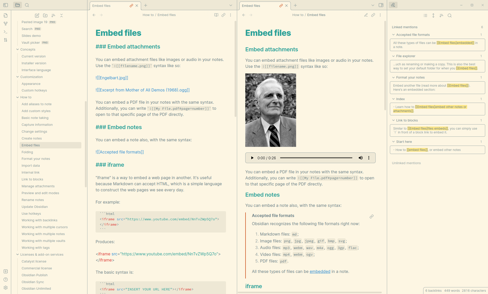
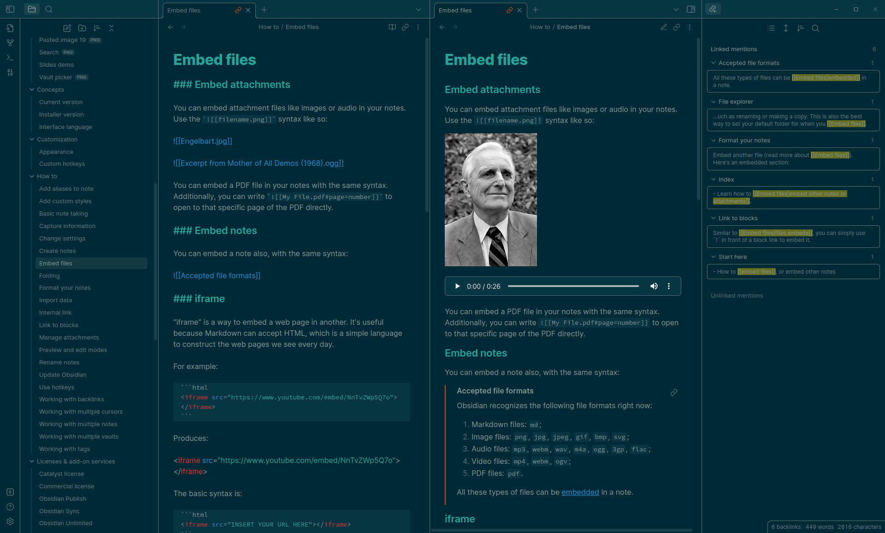

# Solarized for Obsidian

>Precision colors for machines and people

This is a recolor for [Obsidian](https://obsidian.md/) based on [Ethan Schoonover's Solarized color scheme](https://ethanschoonover.com/solarized/). Works as of Obsidian v1.0.0[^1].

If anything is not working for you, please let me know [here](https://github.com/harmtemolder/obsidian-solarized/issues).

[^1]: Older versions of Obsidian might still be able to use the old `obsidian.css`, but there won't be any support going forward.

> **Please weigh in on this discussion: [Should fonts be included, or not?](https://github.com/harmtemolder/obsidian-solarized/issues/29).**

## About Solarized

Some outtakes from [Ethan Schoonover's full write-up](https://ethanschoonover.com/solarized/#features):

>Solarized reduces _brightness contrast_ but, unlike many low contrast colorschemes, retains _contrasting hues_ (based on colorwheel relations) for syntax highlighting readability.

>Solarized retains the same selective contrast relationships and overall feel when switching between the light and dark background modes. A _lot_ of thought, planning and testing has gone into making both modes feel like part of a unified colorscheme.

>The monotones have symmetric CIELAB lightness differences, so switching from dark to light mode retains the same perceived contrast in brightness between each value. Each mode is equally readable. The accent colors are based off specific colorwheel relations and subsequently translated to CIELAB to ensure perceptual uniformity in terms of lightness.

## Features

- This theme respects Obsidian's accent color setting, so you can set that to any of [Solarized's accent colors](https://ethanschoonover.com/solarized/#the-values). This is then used to color UI elements and checkboxes, among others.

## Screenshots

### Light

### Dark

## How to install

Find this theme in the Obsidian's community themes browser under Settings > Appearance > Themes. If that doesn't work, double-check if you are running the latest version of Obsidian.

## How to develop

Make changes in the `scss` files and compile `theme.scss` into `theme.css` using something like [node-sass](https://www.npmjs.com/package/node-sass).

I use the `.vscode/tasks.json` to compile with <kbd>ctrl</kbd>+<kbd>shift</kbd>+<kbd>B</kbd> in [VSCodium](https://github.com/VSCodium/vscodium#readme).

Don't forget to update the version number in `manifest.json`.

## Changelog

All notable changes to this project will be documented here.

The format is based on [Keep a Changelog](https://keepachangelog.com/en/1.0.0/), and this project adheres to [Semantic Versioning](https://semver.org/spec/v2.0.0.html).

### Unreleased

### 1.0.7-beta - 2023-07-24

#### Removed

- Do not adjust font sizes
- Delete legacy `obsidian.css`

### 1.0.6-beta - 2023-07-07

#### Added

- Highlight active line in editor
- `.vscode/tasks.json` (see [How to develop](#how-to-develop))
- Support for [the Dynamic Highlights plugin](https://github.com/nothingislost/obsidian-dynamic-highlights)
  - Yellow highlights to differentiate from other highlights

#### Changed

- Use existing `--code-size` variable for size of monospace fonts in editor and preview
- Color checkboxes in editing view
- Color selected file in file explorer and more contrast when flashing
- More contrast in highlight when clicking from outline tab
- Color search results green to differentiate from other highlights
- Color border of focussed UI element

### 1.0.5-beta - 2022-11-24

#### Changed

- Use less pronounced background colors for input elements in settings menu

### 1.0.4-beta - 2022-11-24

#### Added

- More consistent colors for internal, unresolved and external links
- Bold table headers

#### Changed

- Use accent color for vim cursor
- Use accent color for search results and highlights
- Use accent color for frontmatter dashes and parameters

### 1.0.3-beta - 2022-11-23

#### Changed

- Use accent color for checkboxes in both editing and reading view

### 1.0.2-beta - 2022-11-23

#### Changed

- Follow [Ethan Schoonover's examples](https://ethanschoonover.com/solarized/#screenshots) more closely for code formatting (fixing [#27](https://github.com/harmtemolder/obsidian-solarized/issues/27))

### 1.0.1-beta - 2022-11-22

#### Added

- Orange as default accent color

#### Fixed

- Some control elements in the settings menu that were invisible in dark mode

### 1.0.0-beta - 2022-11-22

#### Fixed

- Issues caused by Obsidian's upgrade to v1.0.0 ([#23](https://github.com/harmtemolder/obsidian-solarized/issues/23), [#25](https://github.com/harmtemolder/obsidian-solarized/issues/25), [#26](https://github.com/harmtemolder/obsidian-solarized/issues/26), [#27](https://github.com/harmtemolder/obsidian-solarized/issues/27))

#### Added

- [Changelog](#changelog)

#### Changed

- Using SCSS instead of plain CSS for cleaner development
- Overwriting Obsidian's default CSS variables instead of overwriting actual CSS rules, where possible
