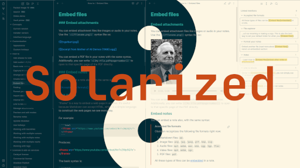

# Solarized for Obsidian

This is just a recolor for [Obsidian](https://obsidian.md/) based on [Ethan Schoonover's Solarized color scheme](https://ethanschoonover.com/solarized/). Works as of Obsidian v1.0.0.

## How to install

Find this theme in the Obsidian's community themes browser under Settings > Appearance > Themes. If that doesn't work, double-check if you are running the latest version of Obsidian.

Older versions of Obsidian might still be able to use the old `obsidian.css`, but there won't be any support going forward.

## How to use

- This theme respects Obsidian's accent color setting, so you can set that to any of [Solarized's accent colors](https://ethanschoonover.com/solarized/#the-values).

## How to develop

Make changes in the `scss` files and compile `obsidian.scss` into `obsidian.css` using something like [node-sass](https://www.npmjs.com/package/node-sass).

I use [the sass-autocompile plugin for Atom](https://atom.io/packages/sass-autocompile) which compiles automatically when saving `obsidian.scss`.

## Changelog

All notable changes to this project will be documented here.

The format is based on [Keep a Changelog](https://keepachangelog.com/en/1.0.0/), and this project adheres to [Semantic Versioning](https://semver.org/spec/v2.0.0.html).

### 1.0.1-beta - 2022-11-22

#### Added

- Orange as default accent color

#### Fixed

- Some control elements in the settings menu that were invisible in dark mode

### 1.0.0-beta - 2022-11-22

#### Fixed

- Issues caused by Obsidian's upgrade to v1.0.0 ([#23](https://github.com/Slowbad/obsidian-solarized/issues/23), [#25](https://github.com/Slowbad/obsidian-solarized/issues/25), [#26](https://github.com/Slowbad/obsidian-solarized/issues/26), [#27](https://github.com/Slowbad/obsidian-solarized/issues/27))

#### Added

- [Changelog](#changelog)

#### Changed

- Using SCSS instead of plain CSS for cleaner development
- Overwriting Obsidian's default CSS variables instead of overwriting actual CSS rules, where possible
