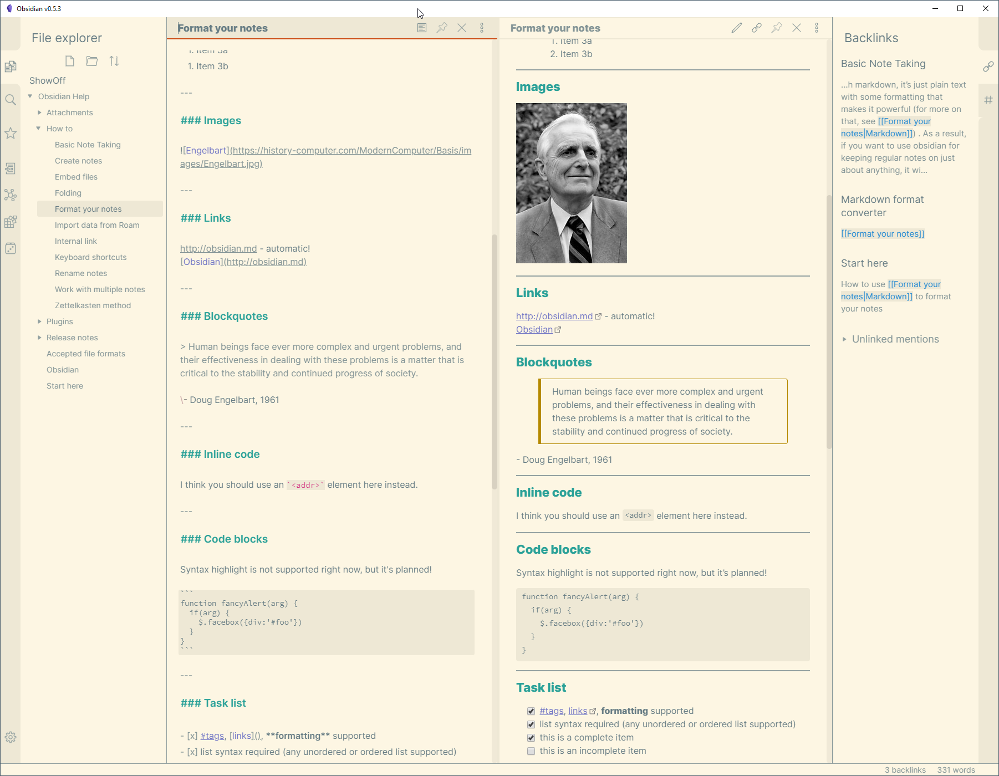
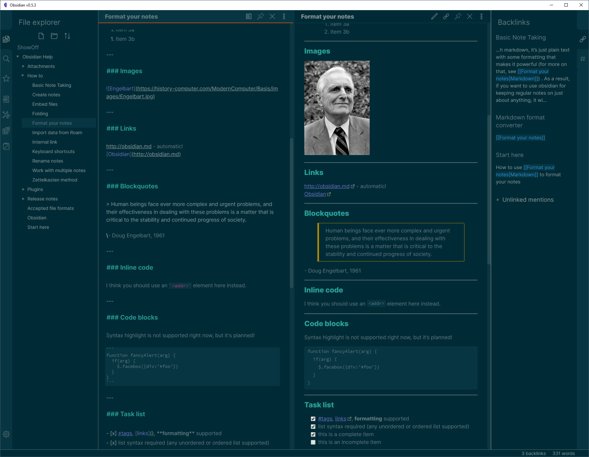

# Solarized for Obsidian

This is just a recolor for [Obsidian](https://obsidian.md/) based on [Ethan Schoonover’s Solarized color scheme](https://ethanschoonover.com/solarized/). Works as of Obsidian 0.6.4.

## Instructions to install

Find this theme in the Obsidian’s community themes browser under Settings > Appearance.

Alternatively, download `Solarized.css` to `.obsidian/themes` in your Vault folder and activate it under Settings > Appearance.

(For older versions of Obsidian that do not support themes yet, rename `Solarized.css` to `obsidian.css` and place it in the root of your Vault.)
